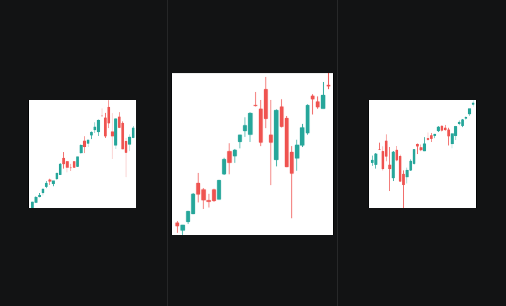
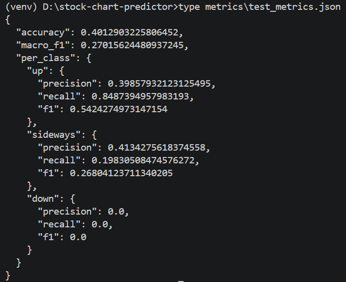
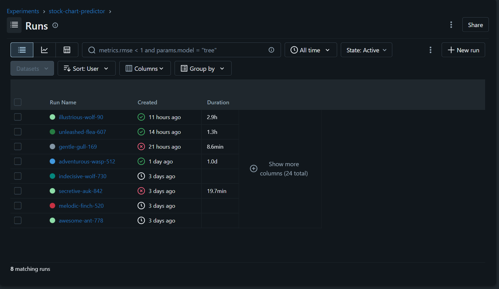
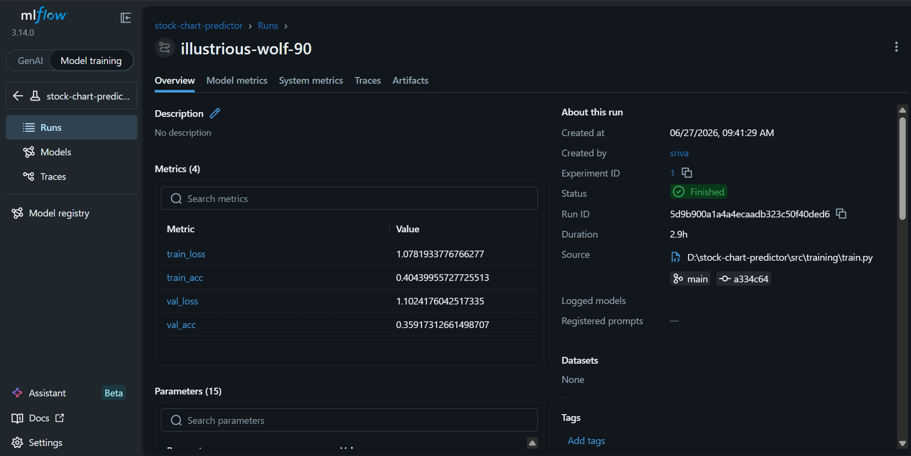
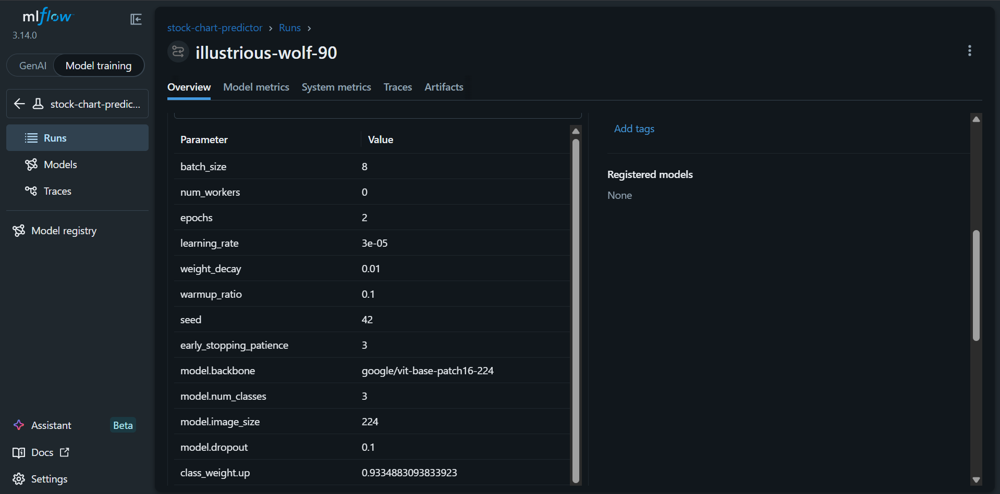
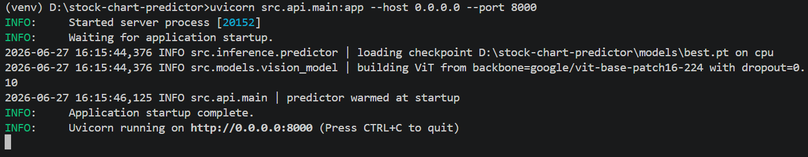
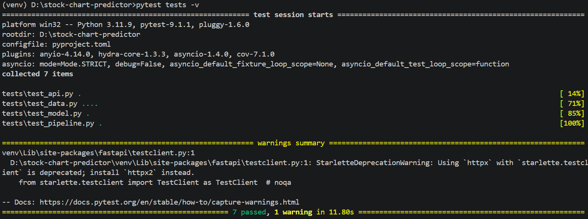

<!--
=============================================================================
File        : README.md
Author      : Prakhar Srivastava
Date        : 2026-06-27
Description : Portfolio landing page for the stock-chart-predictor project.
              End-to-end DLOps demonstration: ViT chart classifier wrapped
              in a reproducible DVC pipeline, MLflow-tracked, FastAPI-served,
              Gradio-demoed, observability-instrumented, container + K8s
              deployable, and CI/CD'd.
=============================================================================
-->

# stock-chart-predictor


> End-to-end **DLOps showcase**: a Vision Transformer fine-tuned to classify
> 30-day candlestick charts into 3 forward-direction classes (**up / sideways / down**),
> wrapped in a reproducible DVC pipeline, MLflow tracking, FastAPI inference,
> Gradio demo, Prometheus/Grafana observability, Docker + Kubernetes deploy,
> and full GitHub Actions CI/CD.

---

## Demo

https://github.com/user-attachments/assets/REPLACE-WITH-APP-DEMO-MP4-URL

*(Upload `docs/App Demo.mp4` as a GitHub asset and paste the URL here — see "Embedding videos" at the bottom.)*

---

## Use case

Given a 30-day candlestick chart of an S&P 500 ticker, predict the direction
of the 5-day forward return (**±2% threshold → up / sideways / down**). An
OpenAI-backed explainer pairs each prediction with a one-paragraph rationale
in plain English.

### What the model sees

Three representative chart windows — one from each class — show what the ViT actually classifies.



| Up | Sideways | Down |
|---|---|---|
| ascending staircase | flat / choppy | descending cliff |

---

## Architecture

The system has four tiers: user-facing UI (Gradio), inference (FastAPI with
ViT vision model + OpenAI explainer), training (DVC + MLflow), and
infrastructure (GitHub Actions CI/CD, Terraform-provisioned GKE).

### Zone 1 — User tier


### Zone 2 — Inference tier


### Zones 3 & 4 — Training + CI/CD + Infrastructure


---

## DLOps surface area

- **DVC pipeline** with parameter + dependency hashing for reproducible reruns
- **MLflow** for hyperparameter, metric, and artifact tracking
- **Time-aware train/val/test split** — chronological, no random shuffling, no leakage
- **Class weighting** in the loss function to counter label imbalance
- **FastAPI** inference server with `/healthz`, `/predict`, `/metrics`
- **Prometheus + Grafana** observability stack via docker-compose
- **Gradio** demo UI sitting alongside the API
- **GitHub Actions** for CI (lint, type-check, test) and CD (image build, GKE rollout)
- **Terraform** for the GCP foundation: GKE Autopilot, GCS DVC remote, Artifact Registry
- **Kubernetes** manifests with HPA, Ingress, ConfigMap, Secret template
- **Docker multi-stage builds** with GitHub Actions cache for fast CI rebuilds
- **Memory-mapped checkpoint loading** for robust serving on fragmented systems

---

## Training pipeline

The DVC DAG defines six reproducible stages from raw CSV to trained model:

```
load_ohlcv → label_windows → render_charts → build_dataset → train → evaluate
```

https://github.com/user-attachments/assets/REPLACE-WITH-DVC-DAG-MP4-URL

*(Upload `docs/DVC-Dag.mp4` as a GitHub asset and paste the URL here.)*

---

## Results

Single-run honest reporting from the held-out chronological test set.

### Test metrics



| Class | Precision | Recall | F1 |
|---|---|---|---|
| up       | 0.40 | 0.85 | 0.54 |
| sideways | 0.41 | 0.20 | 0.27 |
| down     | 0.00 | 0.00 | 0.00 |
| **Macro** | – | – | **0.27** |

**Test accuracy: 0.40** (vs. 0.33 random baseline for three classes)

### Confusion matrix


### Honesty note on the numbers

This project is a **DLOps demonstration**, not an alpha-generating signal.

- Two CPU epochs is far from convergence — ViT-base needs many more epochs (or a GPU) to specialize from ImageNet pretraining onto chart patterns
- The down class collapsed at 0.0 recall — class weighting helped marginally; the real fix is freezing the backbone or migrating training to GPU
- The pipeline, reproducibility, and operational story are the actual portfolio value, not the headline accuracy

A reviewer with finance / ML background should recognize the engineering depth and treat the modest metrics as the deliberate scope choice they are.

---

## Experiment tracking (MLflow)

Every training run is logged with full provenance: source file path, git commit hash, hyperparameters, metrics, and artifacts.

### Runs list — all experiments at a glance


### Run summary — final metrics, status, source, git lineage


### Logged parameters — every hyperparam tracked, including computed class weights


---

## Live demo + API

### Swagger UI — auto-generated OpenAPI 3.1 contract


### FastAPI startup — model loaded, server listening


### Prometheus `/metrics` endpoint — observability instrumented


---

## Engineering quality

### Code style — ruff (zero violations)


### Type checking — mypy (zero issues)


### Test suite — 7 tests passing across data, model, API, and pipeline layers


### Commit hygiene


---

## Quickstart

```bash
# 1. Install dev + runtime requirements
make dev

# 2. Set up environment (.env)
cp .env.example .env
# Edit .env to add OPENAI_API_KEY, HF_TOKEN, DVC_GDRIVE_FOLDER_ID

# 3. Drop the Kaggle dataset into data/raw/
# https://www.kaggle.com/datasets/andrewmvd/sp-500-stocks

# 4. Run the full pipeline (data → training → evaluate)
dvc repro

# 5. Serve the API
make serve

# 6. Launch the demo (in a separate terminal)
python -m src.ui.gradio_app
```

Then open:
- API docs:    http://localhost:8000/docs
- Gradio demo: http://localhost:7860
- MLflow UI:   `mlflow ui` → http://localhost:5000

---

## Tech stack

| Layer | Tool |
|---|---|
| Modeling | PyTorch + HuggingFace ViT |
| Experiment tracking | MLflow |
| Data versioning | DVC (Google Drive remote) |
| Serving | FastAPI + Uvicorn |
| Demo UI | Gradio |
| LLM explainer | OpenAI `gpt-4o-mini` |
| Observability | Prometheus + Grafana |
| Container | Docker + docker-compose |
| Orchestration | Kubernetes (GKE Autopilot) |
| Cloud | Google Cloud Platform |
| Infrastructure as Code | Terraform |
| CI/CD | GitHub Actions + Jenkins |

---

## Repo layout

```
.
├── src/                  # FastAPI, training, inference, UI, models, data
├── config/               # Runtime configs (model, serving, data)
├── data/                 # DVC-tracked datasets (raw / interim / processed / splits)
├── docker/               # Dockerfiles + docker-compose stack + prometheus.yml
├── k8s/                  # Kubernetes manifests for GKE
├── terraform/            # Cloud foundation (cluster, bucket, registry)
├── jenkins/              # On-prem alternative CI pipeline
├── scripts/              # Deploy and DVC setup scripts
├── tests/                # Pytest suite (data, model, API, pipeline smoke)
├── notebooks/            # Exploration
├── docs/                 # Architecture diagrams, demo captures, screenshots
├── .github/workflows/    # CI / CD / DVC-repro automation
├── params.yaml           # DVC-tracked hyperparameters
└── dvc.yaml              # DVC pipeline definition
```

---

## Embedding videos (one-time setup)

The two videos referenced in this README (`docs/App Demo.mp4` and `docs/DVC-Dag.mp4`) are too large to embed via relative path. To make them playable inline:

1. Open a **draft issue** in this repo (don't submit)
2. Drag-and-drop each MP4 into the comment box
3. GitHub uploads and gives you a `https://github.com/user-attachments/assets/...` URL
4. Replace the `REPLACE-WITH-...-MP4-URL` placeholders in this README with those URLs
5. Cancel the draft

Result: videos play inline in the README with zero repo bloat.

---

## License

See [LICENSE](LICENSE).
